# Phil Chu, Technicat LLC

Las Vegas, Nevada, United States
 [https://technicat.com/](https://technicat.com/)

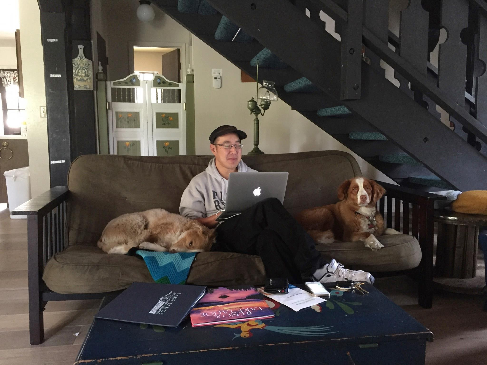

 [technicat](https://github.com/technicat) @ Github [pc](https://technicat.cafe/@pc) @ Mastodon

Developing software since the 80s
## Career

### working for myself @ [Technicat LLC](http://technicat.com) 

January 2000 to present

Consulting and contract development, self-publishing apps and games.

### working for the man @ [various](https://en.wikipedia.org/wiki/Working_for_the_Man_(song)) 

June 1988 to June 2001

Journeyed through the semiconductor, defense, space, computer graphics, mobile Internet, and video game industries.

## Projects

### [Talk Dim Sum](http://talkdimsum.com/) @ Technicat
developer, publisher from January 2014 to present

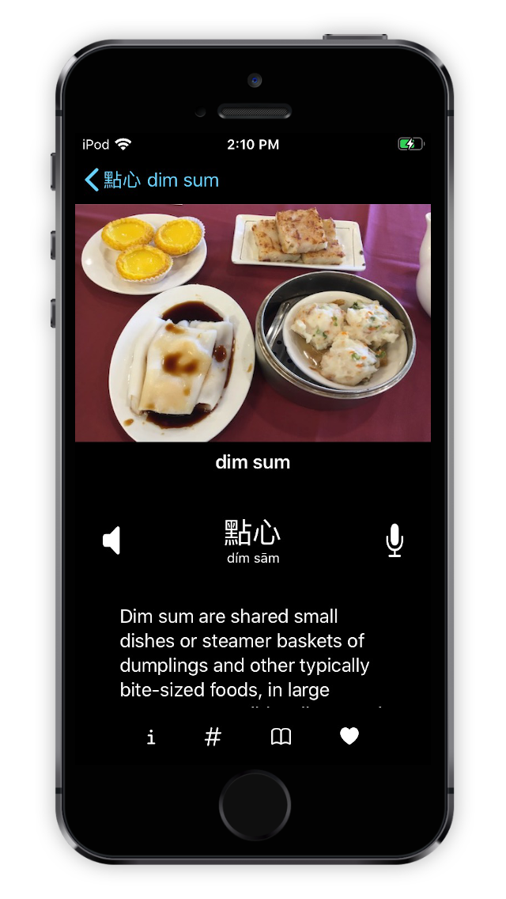

Your dim sum companion. Read about dim sum and learn how to pronounce the dishes. Available on Itch.io and the App Store.

*app:* *iOS, Swift, dim sum*

### [HyperBowl](http://hyperbowl3d.com/) @ Technicat
developer, publisher, licensee from December 2008 to December 2019

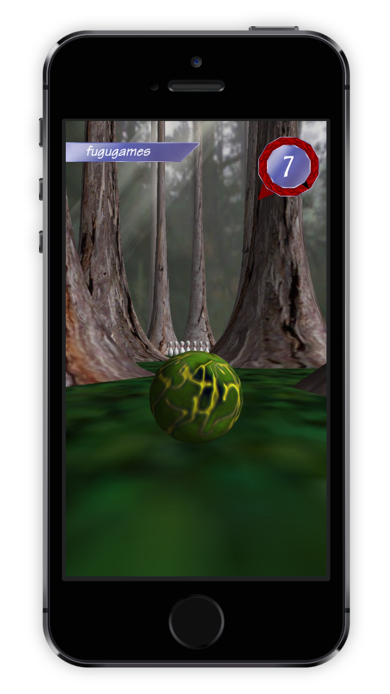
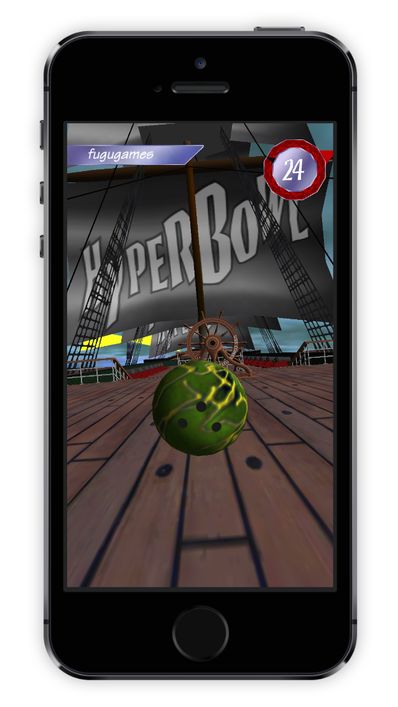

Be the ball! A Unity reimplementation of the classic bowling game, licensed from Hyper Entertainment.

- One of MacLife's Greatest iPhone Apps of 2009

- Available on the App Store and Steam

- Formerly available on the Amazon Appstore, Nook store, Itch.io, and various crappy app stores (crappstores?)

*game:* *bowling, 3D, Unity*

### [Cinefex iPad Edition](https://apps.apple.com/us/app/cinefex/id512379220) @ Cinefex
developer from April 2016 to present

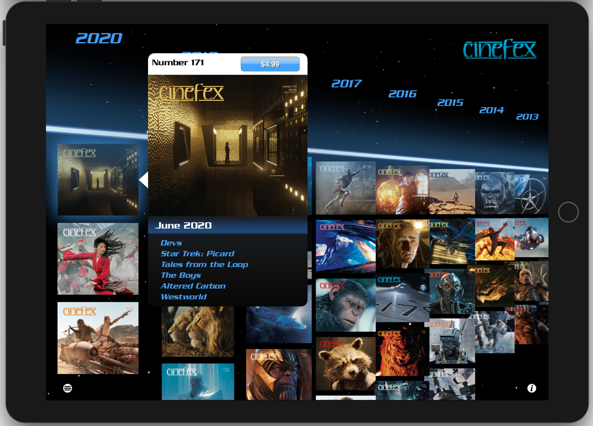

An iPad reader for the Cinefex visual effects magazine, with extras such as videos and image galleries.

- Facilicated transfer from original developer to Cinefex LLC

- Fixed in-app-purchase issues

- Updated video player after Apple dropped support for previous API

- Updated issue download code after Apple dropped support for previous API (notice a trend?)

- Optimized startup time and browsing

- Updated to comply with ever-changing Apple requirements

*app:* *iOS, magazine, visual effects*

### [Emo-Ray vs. the Intergalactic Teddy Bears](https://blog.playstation.com/2012/11/26/save-playstation-home-from-teddy-bears/) @ Heavy Water
programmer from September 2011 to December 2011

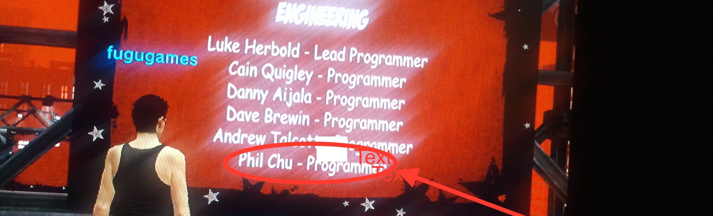

A Playstation Home driving/shooting game with alien invader teddy bears.

- Implemented collision physics among cars

- Programmer credit displayed in-world

*game:* *Playstation 3, Playstation Home, virtual world*

### [RC Rally](https://pshome.fandom.com/wiki/RC_Rally) @ Heavy Water
programmer from September 2011 to December 2011

A Playstation Home multiplayer racing game.

- Made some UI fixes just before release

*game:* *Playstation 3, virtual world, racing*

### [Blue Mars](http://bluemars.com/) @ Avatar Reality
programmer from September 2007 to January 2011

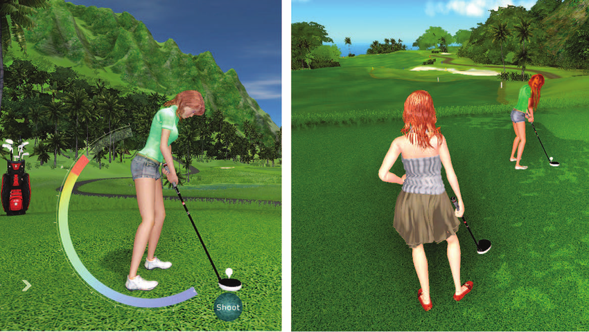
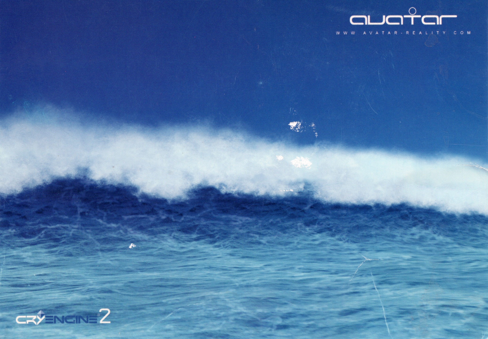
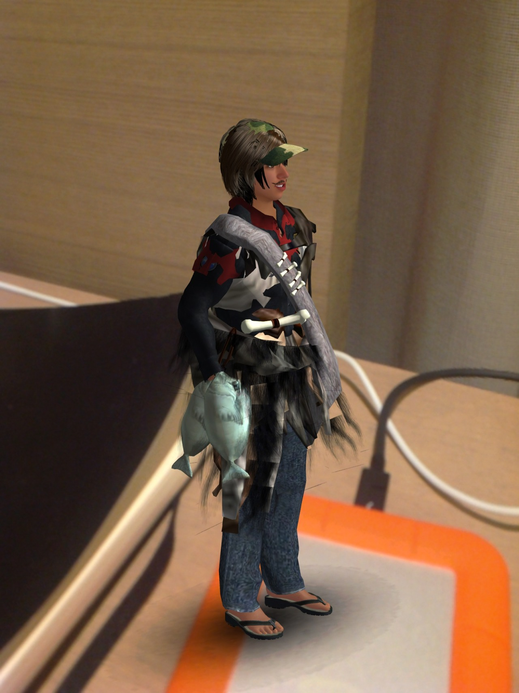

A 3D virtual world implemented with CryEngine.

- Documented the Lua API and framework for creating minigames on the community wiki (a CryEngine wiki even copied part of it!)

- Integrated newer versions of Scaleform, including Scaleform IME for localization

- Tweaked CryEngine physics to support an in-world golf game

- Attended in-world developer meetings. Better than Zoom.

*virtual world:* *CryEngine, metaverse, Lua, C++*

### [Nendo](https://web.archive.org/web/20070628000134/http://www.izware.com/nendo/index.htm) @ Izware
programmer from May 2007 to June 2007

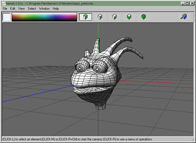

A nifty 3D modeler originally developed at Nichimen Graphics.

- Updated to work on Windows XP.

*graphics:* *3D, C++*

### [Darkwatch](https://www.mobygames.com/game/darkwatch) @ High Moon Studios
programmer from September 2006 to April 2007

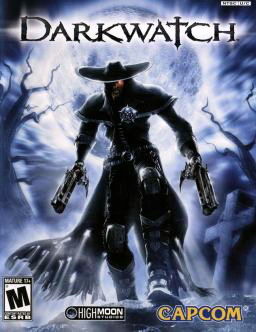

A vampire western for Playstation 2 and Xbox. demo builds.

- Worked on HUD elements for health, ammo, special powers

- Implemented split-screen (multiple Renderware cameras) for multiplayer

- Added PAL support

- Integrated Lua scripting for audio effects and HUD elements

- Received programmer credit (but oddly required to list city of birth)

*game:* *Renderware, Xbox, Playstation 2, Lua, C++*

### [Fugu Games](http://fugugames.com/) @ Technicat
developer from June 2007 to present

Small games released as webplayers, Mac widgets, and mobile apps.

- Fugu Maze, a suspense maze walkthrough that got twenty thousand downloads on the App Store in the first week and then a trickle after I started charging for it

- Fugu Bowl, a simple proof of concept for HyperBowl that got low ratings but was my most downloaded app (until Apple rejected upgrades).

*game:* *3D, 2D, Unity, J2ME, C#*

### [Tech Deck: Bare Knuckle Grind](https://archive.org/details/bkg-space-town) @ Visionscape Interactive
programmer from December 2003 to May 2004

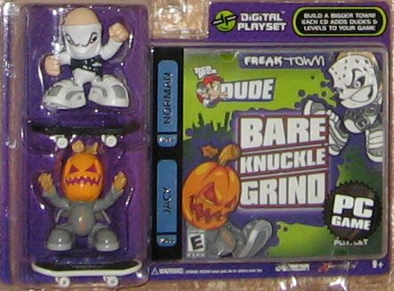

A skateboarding game bundled with Tech Deck figures.

- Implemented installers so each game could be packaged separately and installed in any sequence

- Added dynamic shadows to replace the placeholder blob shadows (and then switched back to the blog shadows because the art director liked them better)

- Set up a push-button scripted build system so the producers could create a latest build from the subversion source at any time

*game:* *Windows, Renderware, C*

### [HyperBowl](https://en.wikipedia.org/wiki/Hyperbowl_Plus!_Edition) @ Hyper Entertainment
programmer from January 2001 to June 2001

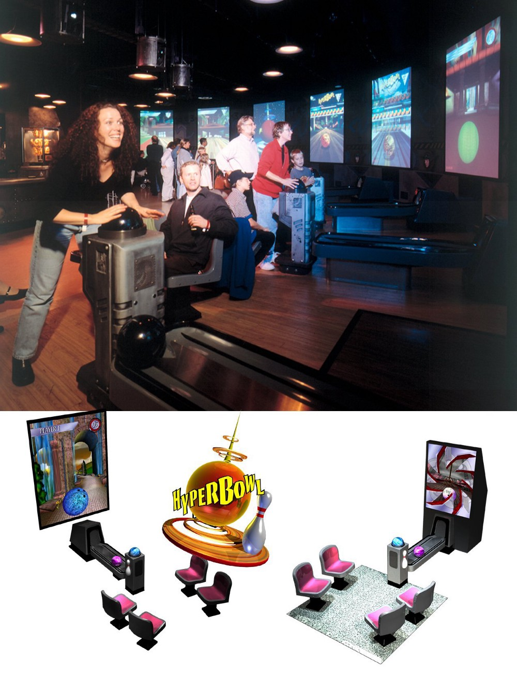

A 3D attraction bowling game, rolling in fanciful locations.

- Added localization support, particularly for Jillian's installations in Montreal (French)

- Implemented support for (potential) new lanes, e.g. a toy room, motocross slope...

- Profiled, optimized (those lanes kept getting bigger and bigger)

- Fixes for new graphics cards (pesky w-buffer...)

- Changes to facilitate arcade and PC versions (I'm there in the mobygames credits)

*game:* *3D, Windows, arcade, attraction, C++*

### [Neomar](https://googlepress.blogspot.com/2000/09/google-search-engine-now-available.html) @ Neomar
programmer from December 1999 to July 2001

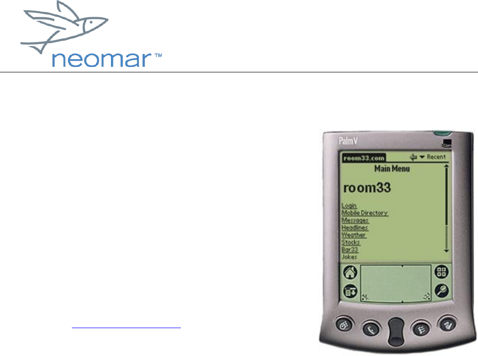

One of the first mobile web browsers, conforming to WAP standards.

- Implemented an HTTP proxy in Java for the Neomar WAP gateway

- Launched on Motient's Blackberry service

- Company assets acquired by Good Technology

*enterprise:* *WAP, HTTP, mobile, Java*

### [Leverage for Scheduling](https://spinoff.nasa.gov/spinoff1998/ct11.htm) @ Interval Logic
programmer from December 1998 to December 1999

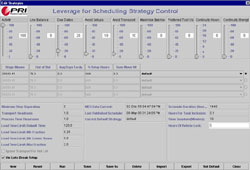

Supply chain scheduling software for semiconductor fabs. Managed the group reponsible for installation, XML interoperability, and user interfaces.

*enterprise:* *Java, XML*

### [Leverage for Planning](https://web.archive.org/web/19991105062823/http://www.interval-logic.com/news/lsi.html) @ Interval Logic
programmer from November 1998 to November 1998

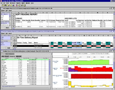

Supply chain planning software for semiconductor fabs. Upgraded from Tcl to TclPro.

*enterprise:* *Tcl*

### [Mirai](https://en.wikipedia.org/wiki/Mirai_(software)) @ Nichimen Graphics
consultant from September 1997 to September 1997

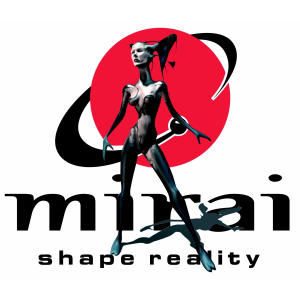

Successor to N-World

- Fixed some graphics code (which I eventually realized was originally written by me)

- visited 3D hardware vendors in Silicon Valley (including a young nVidia) to get test cards and discuss OpenGL issues

- Used to make Gollum in the Lord of the Rings movies.

*graphics:* *3D, OpenGL, Windows*

### [N-World](https://en.wikipedia.org/wiki/N-World) @ Nichimen Graphics
programmer from December 1995 to June 1997

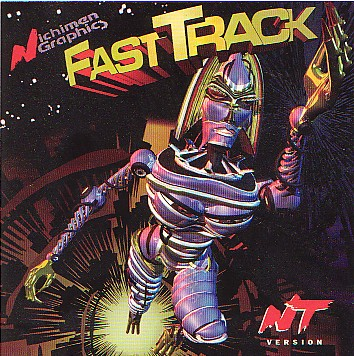

A 3D modeling and animation package descended once upon a time from the Symbolics Graphics Group (written in Lisp, shhh!).

- Ported from IrisGL to OpenGL on SGI workstations

- Ported from Irix to Windows NT

- Manager of Core Software (I made up the title)

- Used in the making of Mario 3D.

*graphics:* *3D, OpenGL, Irix, Windows*

### [ORBIS](https://www.jhuapl.edu/Content/techdigest/pdf/V23-N04/23-04-Higgins.pdf) @ JHU Applied Physics Lab
programmer from December 1992 to December 1993

An expert system for submarine simulation.

- Added support for local area network simulations (i.e. games)

- Added Distributed Interactive Simulation support for wide-area network simulations (wargames)

- Donned a submarine uniform and took part in two exercises like I was in The Hunt for Red October

*government:* *Distributed Interactive Simulation, Lisp, C++*

### [Proposal Entry Processor](https://hst-docs.stsci.edu/hpiom/chapter-2-the-basics-of-phase-ii-proposals) @ Space Telescope Science Institute
programmer from November 1990 to May 1992

A syntax-directed Emacs mode used by astronomers and Institute staff to prepare and edit Space Telescope observation proposals.

- A member of the proposal preparation staff asked for my project to be continued after I left (but alas, no takers).

*government:* *space, emacs, Lisp*

### [Database Accelerator](https://www.semanticscholar.org/paper/The-MIT-database-accelerator%3A-2K-TRIT-circuit-Wade-Osler/8265f5f166e20d9bd60ad71fa62f873519fe4a0c) @ MIT
programmer from October 1989 to October 1990

A computer architecture based on content-addressable memories. Implemented compilers and simulators and simulations for the Database Accelerator and Content-Addressable Parallel Processor.

*research:* *VLSI, CAD, Lisp*

### [DROID](https://www.researchgate.net/publication/3524170_Circuit_optimization_techniques_in_DROID) @ Texas Instruments
programmer from May 1988 to September 1989

A VLSI layout synthesis tool, used in-house to design new products, running on TI Explorer Lisp Machines. Added optimizations and other improvements, skipped most of the meetings (also an optimization).

*enterprise:* *VLSI, CAD, Lisp*

### [Multilisp](https://en.wikipedia.org/wiki/MultiLisp) @ MIT
student from September 1987 to May 1988

Bachelors thesis project implementing an Othello game in Multilisp (Multello) to run on the Concert 32-processor computer, trying various parallelism strategies to compare processor utilization and final performance.

- Wrote the thesis in LaTeX on a Symbolics Lisp Machine.

- Cited in a PhD thesis.

*research:* *game, parallel processing, Lisp*

### [START](http://start.csail.mit.edu/index.php) @ MIT
student from June 1987 to August 1987

Part time student work on a graph display for the the START natural language parser, then running on Symoblics Lisp machines.

*research:* *natural language, Lisp*

## Publications

### [Learn Unity 2014 for iOS Game Development](http://technicat.com/learnunity)

Published June 2013 by Apress

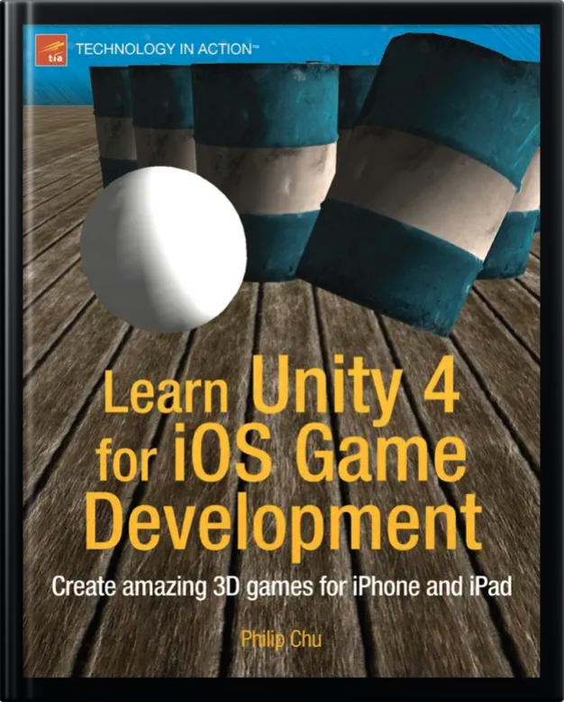

Introduction to mobile game development with the Unity game engine.

### [Technicat on Software](http://technicat.com/technicat-on-software)

Published January 2015 by self

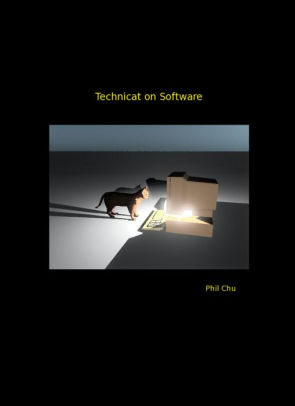

Collection of software development essays.

## Education

### [Johns Hopkins University](https://jhu.edu/)

September 1991 to May 1993

Masters degree in Computer Science, 3.x GPA

*AI, computer graphics, automata, algorithms, compilers, functional programming*
### [Massachusetts Institute of Technology](https://mit.edu/)

September 1984 to May 1988

Bachelors degree in Computer Science and Engineering, 3.x GPA

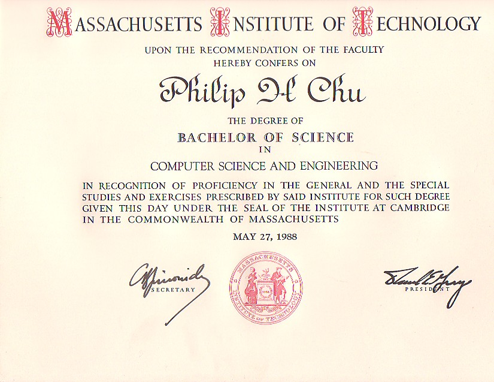
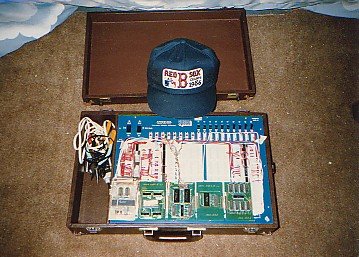

*6.001, 6.002, 6.003, 6.004*
### [West Senior High School](https://www.iowacityschools.org/WestHS)

September 1981 to May 1984

High school degree in Iowa, 3.x GPA

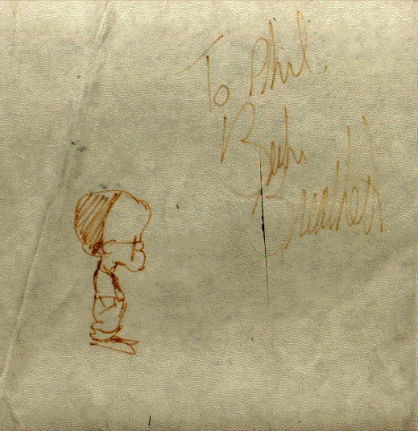
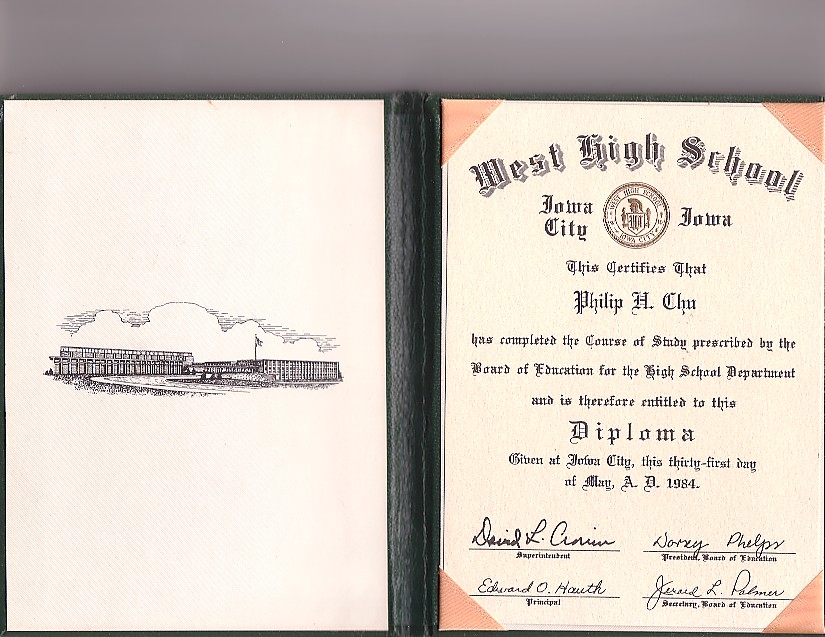

## Languages

Native speaker in English

Food in Cantonese

Kdrama phrases in Korean

## Interests

### Cats

*adoption, cat cafe, lucky cat, samurai cat*

### Reading

*Asian-American fiction, graphic design, graphic novels, history, philosophy, scifi, spy stories, technology*

### Viewing

*kdrama, scifi, MMA*

### Learning

*English, Spanish, Chinese, Korean, Japanese*

### Listening

*Motown, NPR Podcasts*

### Playing

*piano, video games*

## Skills

### App Development (Experienced)
*Flutter, J2ME, SwiftUI, Xamarin*

### Game Development (Experienced)
*CryEngine, Godot, Havok, Qube, Renderware, Ren'py, Scaleform, Unity, Unreal*

### Graphics (Experienced)
*Direct3D, OpenGL, Processing*

### Programming (Experienced)
*6502, BASIC, C, C++, C#, Dart, Java, Javascript, Lisp, Lua, Objective-C, Perl, PHP, Python, Swift, Tcl*

### Writing (Experienced)
*English, books, press releases*

## Awards

### Leverage for Planning/Scheduling
Interval Logic on April 1999
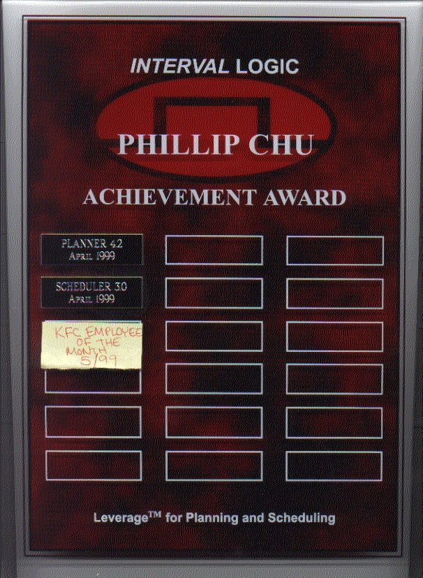

They misspelled my name.

### Maritime Simulation Demonstration
ARPA on October 1993
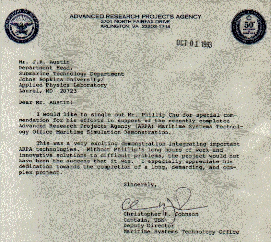

They misspelled my name, too.

### First Hubble Servicing Mission
Space Telescope Science Institute on December 1993
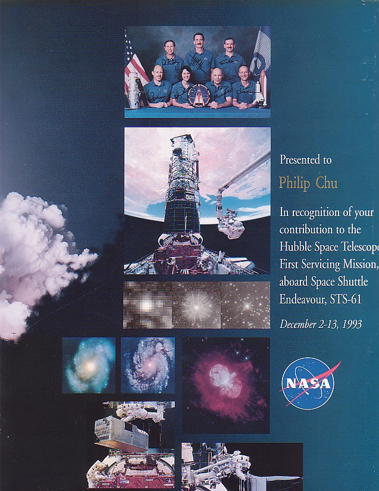

Includes a patch flown on the first Hubble servicing mission. Best workplace award ever. And they got my name right.

## Certificates

### Neomar stock
[Neomar](https://googlepress.blogspot.com/2000/09/google-search-engine-now-available.html) on July 2000

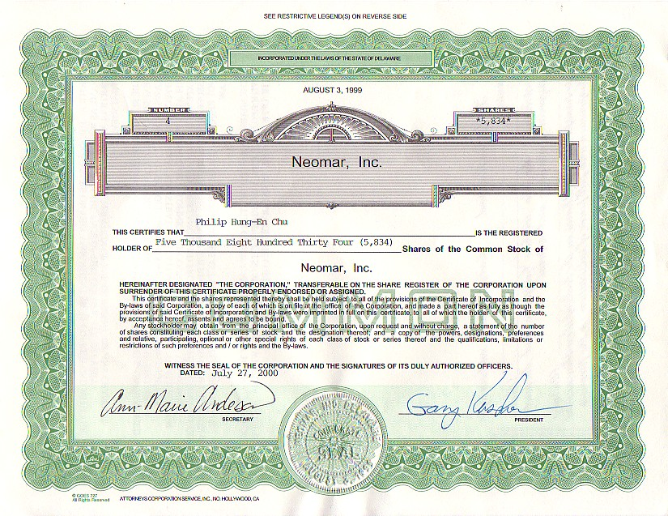

## References

### Former client

> I still think you're a good programmer.

### Prospective client

> I've got a genius app idea!

